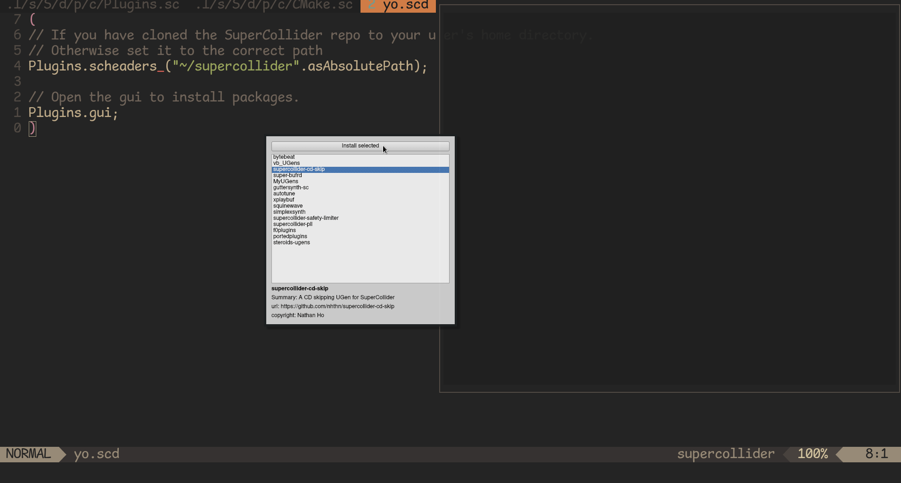

# Plugins.quark
 

This is a simple package management system for installing SuperCollider plugins. It automatically downloads, compiles and installs UGens on your system. It contains a directory of plugins and an easy to use GUI inspired by the Quark system.

## Prerequisite

To use this package, you need to have `cmake` installed. The easiest way to do this is to use your operating system's package manager (homebrew or macports on MacOS, apt on Ubuntu, pacman on Arch, etc.). This package will automatically check if it is installed properly and let you know if it isn't.

## Installation

```supercollider
Quarks.install("https://github.com/madskjeldgaard/plugins.quark.git")
```

## Usage

```supercollider
// Open the gui to install packages.
Plugins.gui;
```

See the helpfile for "Plugins" for more information on usage.

## Development

This project is still a work in progress - but please, help out if you can. I am particularly grateful for pull requests that fixes things, but also issues. Thanks.
