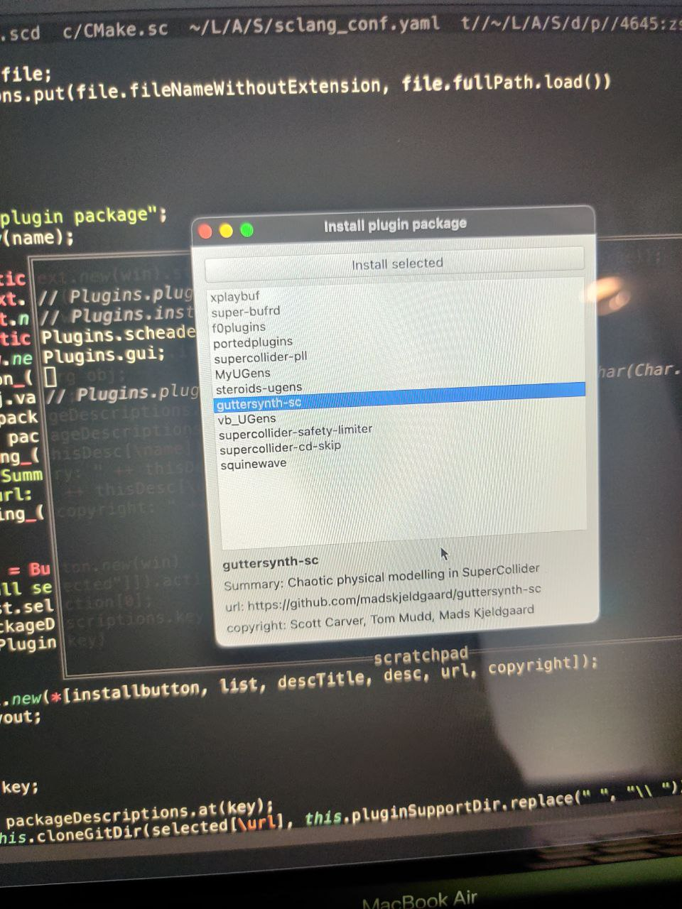

# Plugins.quark
 

This is a simple package management system for installing SuperCollider plugins. It automatically downloads, compiles and installs UGens on your system. It contains a directory of plugins and an easy to use GUI inspired by the Quark system.

## Installation

```supercollider
Quarks.install("https://github.com/madskjeldgaard/plugins.quark")
```

## Usage
```supercollider
// If you have cloned the SuperCollider repo to your user's home directory.
// Otherwise set it to the correct path
Plugins.scheaders_("~/supercollider".asAbsolutePath);

// Open the gui to install packages.
Plugins.gui;
```
